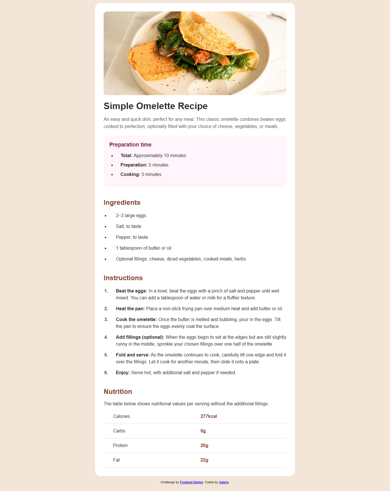

# Frontend Mentor - Recipe page solution

This is a solution to the [Recipe page challenge on Frontend Mentor](https://www.frontendmentor.io/challenges/recipe-page-KiTsR8QQKm).

## Table of contents

- [Overview](#overview)
  - [Screenshot](#screenshot)
  - [Links](#links)
- [My process](#my-process)
  - [Built with](#built-with)
  - [What I learned](#what-i-learned)
  - [Continued development](#continued-development)
- [Author](#author)

### Screenshot

### Links

- Solution URL: https://www.frontendmentor.io/solutions/recipe-page-html-css  
- Live Site URL: https://your-live-site-url.com

### Built with

- Semantic HTML5
- CSS custom properties
- Flexbox
- Mobile-first workflow

### What I learned

In this project I practiced:

- Structuring content using semantic HTML.
- Styling with CSS variables.
- Creating clean layouts using Flexbox.
- Improving spacing and typography to match a design.

This challenge helped me understand how small details like margins, font sizes and colors can make a big difference in the final result.

### Continued development

I want to continue improving my layout skills and focus more on:

- Responsive design
- Better use of Flexbox and Grid
- Writing cleaner and more organized CSS

## Author

- Frontend Mentor - @Valeria  
- GitHub - https://github.com/your-username  
